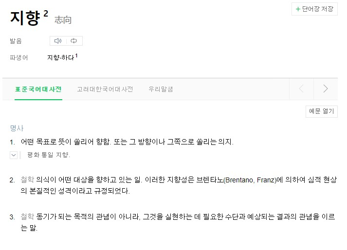

# Chapter2-1 절차지향과 객체지향

<br>

## 절차지향 vs 객체지향

### 절차지향

순사적 프로그래밍  
컴퓨터 작업 처리 방식과 유사 -> 처리가 빠르다  
유지보수가 어렵다(아래 설명)

### 객체지향

역할별로 클래스(객체)를 나누어 프로그래밍  
실제세계? ex. 은행 - 고객 , ATM


## 지향이란?



C언어는 절차지향<br>
Java는 객체지향으로 나누는 것이 아니다.

<br><br>

## 대조되는 기법?

> 절차지향은 객체 지향의 대조되는 기법인가? X

절차지향 - 데이터 중심 실행 초점<br>
객체지향 - 기능, 관계 초점<br>

> 책에서 말하는 요점

단순 데이터 실행을 위주로 프래그래밍을 하는것이 아닌(절차지향)  
객체라고 불리는 단위를 중심으로 데이터, 함수를 만들어(객체지향) 유지보수의 용이성을 가져가자.

> 예시

#### 게임

직업 : 궁수 , 기사 ~  
행동 : 공격

- 절차지향일때
```
Main  
입력 : 궁수 공격
A = 궁수
B = 공격

if(A == 궁수){
    if(B == 공격){
        화살 공격
    }
}
else if(기사){
    if(공격){
        검 공격
    }
}
```
- 객체지향일때
```
Class 궁수{
    void 공격{
        화살 공격
    }
}
Class 기사{
    void 공격{
        검 공격
    }
}

Main  
입력 : 궁수 공격
A = 궁수
B = 공격
객체 캐릭터 = null
if(A == 궁수){ <- 리플렉션 or 인터페이스
    캐릭터 = new 궁수();
}

A.B
```

직업이 늘어날 때?  
행동이 늘어날 때?  
인터페이스로 묶는다면?  
유지보수의 용이성
<br><br>
