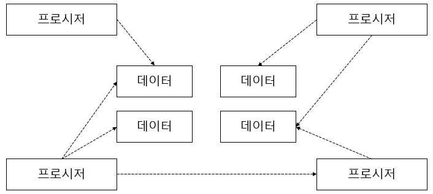
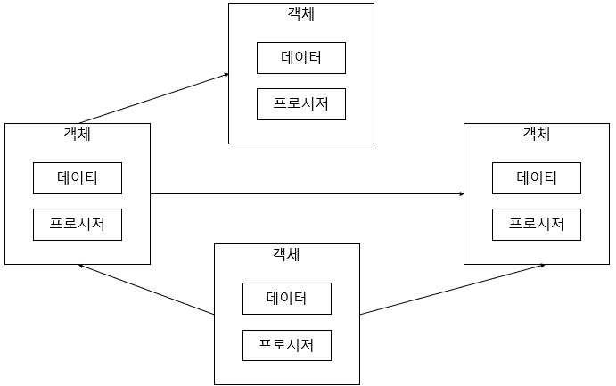

# 1 절차지향과 객체지향

## 절차지향

### 절차 지향은 데이터를 중심으로 한 프로시저로 구성된다.



### 문제점

- 데이터 타입이나 의미를 변경해야 할 때, 함께 수정해야 하는 프로시저가 증가한다.
- 같은 데이터를 프로시저들이 서로 다른 의미로 사용하는 경우가 발생한다.

## 객체지향

### 데이터 및 데이터와 관련된 프로시저를 객체(object)라고 부르는 단위로 묶는다.

- 객체는 자신만의 데이터와 프로시저를 갖는다.
- 객체는 자신만의 기능을 제공한다.
- 객체는 다른 객체에 기능을 제공하기 위해 프로시저를 사용하는데, 프로시저는 자신이 속한 객체의 데이터에만 접근할 수 있다.
- 객체의 변경은 해당 객체에만 영향을 준다.  
  

# 2 객체

## 객체의 핵심은 기능을 제공하는 것

- 객체가 제공하는 기능이 중요하지 데이터를 어떻게 다루는지 어떤 데이터 타입인지는 중요하지 않다.

## 인터페이스와 클래스

- 객체가 제공하는 기능을 오퍼레이션(operation)이라고 부른다.
- 오퍼레이션 사용법은 세 개로 구성되며 시그니처라고 부른다.
  - 기능 식별 이름
  - 파라미터 및 파라미터 타입
  - 기능 실행 결과 값
- 객체가 제공하는 오퍼레이션 집합을 인터페이스(interface)라고 부른다.
  - 인터페이스는 객체를 사용하기 위한 일종의 명세나 규칙

## 메시지

오퍼레이션의 실행 요청을 메시지를 보낸다고 표현한다. (메서드 호출)

# 객체의 책임과 크기

객체-책임 구성 규칙은 없다.  
다만, 객체가 갖는 책임은 작을 수록 좋다.

객체의 책임이 많다면, 데이터를 중심으로 여러 오퍼레이션들이 생겨나면서 절차 지향 방식과 동일한 구조가 된다.  
따라서 기능 변경의 어려움이 생긴다.

관련 원칙

- SRP - Single Responsibility Principle (단일 책임 원칙)
  - 코드 변경의 원인이 한 가지이며 변경 지점이 명확하다.

# 의존

A 객체가 B 객체를 생성, B 객체의 메서드 호출, 파라미터로 B 객체를 받을 때,  
A 객체가 B 객체에 의존한다고 표현한다.

```typescript
class B {
  start() {}
}
class A {
  constructor(b: B) {
    b.start()

    const bb = new B()
  }
}
```

# 캡슐화(encapsulation)

객체가 내부적으로 기능을 어떻게 구현하는지를 감추는 것이다.
이를 통해 내부 구현의 변경이 객체의 기능을 사용하는 코드가 영향을 받지 않도록 한다.
따라서 내부 구현 변경의 유연성을 확보할 수 있다.

- 같은 이유로 변경될 수 있는 데이터, 기능이 캡슐화의 대상으로 볼 수 있을듯 하다.

## 캡슐화를 위한 두 개의 규칙

- Tell, Don't Ask

  - 데이터를 물어보지 말고 기능을 실행하라
  - 데이터를 물어보게 되면 데이터 관련 기능을 구현해야 한다. 이 기능이 여러 곳에서 사용된다면 하나의 객체에 캡슐화 되어 관리되어야 할 데이터 및 로직이 외부로 노출되었다고 해석할 수 있다.

  ```typescript
  if (member.isExpired()) {
    // ...중략
  }
  ```

- 데미테르의 법칙(Law of Demeter)
  - 메서드에서 생성한 객체의 메서드만 호출
  - 파라미터로 받은 객체의 메서드만 호출
  - 필드로 참조하는 객체의 메서드만 호출
    출

```typescript
// X
function main(member: Member) {
  if (member.getDate().getTime() < ...) { // 데미테르 법칙 위반
  /*
  member.getDate만 사용한 것이 아닌 반환받은 date의 메서드를 호출했기 때문에 데미테르 법칙 위반이다.
  */
  }
}

// O / 아래와 같이 변경되어야 한다.
function main(member: Member) {
  if (member.getTime() < ...) {}
}

```

# 객체 지향 설계 과정

1. 제공할 기능을 찾고 또는 세분화하고, 그 기능을 알맞은 객체에 할당한다.

- 기능을 구현하는데 필요한 데이터를 객체에 추가한다. 객체에 데이터를 먼저 추가하고 그 데이터를 이용하는 기능을 넣을 수도 있다.
- 기능은 최대한 캡슐화해서 구현한다.

2. 객체 간에 어떻게 메시지를 주고받을 지 결정한다.
3. 과정1과 과정2를 개발하는 동안 지속적으로 반복한다.

객체 설계는 한 번에 완성되지 않고 점진적으로 완성된다.

- 구현 과정에서 놓치는 경우 / 새로운 요구사항이 있는 경우에 설계가 변경될 수 있으므로 처음부터 완벽한 설계란 없다.

어떤 데이터, 기능이 객체에 추가되어야 할까?
리팩토링 책에서 다루는 악취의 종류를 살펴보면 객체 설계에 도움을 줄 수 있다.  
뒤엉킨 변경 / 산탄총 수술 / 기능 편애 / 데이터 뭉치 등이 있다.

- 산탄총 수술: A 객체 변경 시 다른 객체들의 데이터, 로직들이 변경된다면 수정 대상을 찾기 어렵다. 이런 경우 다른 객체들에 퍼져 있는 데이터 및 로직은 A 객체에 속해야 한다.
- 기능 편애: A 객체가 B 객체의 데이터와 함수와 상호작용을 많이 하는 경우 해당 데이터 및 함수는 A 객체로 옮겨야 한다.
- 데이터 뭉치: 데이터 및 관련 로직이 코드 이곳 저곳에서 뭉쳐 다니면 이들은 하나의 객체에서 다뤄야 한다.
