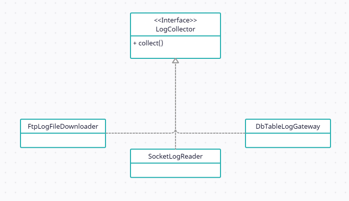

# 상속 개요

상속(Inheritance)은 한 타입을 그대로 사용하면서 구현을 추가할 수 있도록 해주는 방법을 제공

- 객체가 다른 객체를 상속받아 상속받은 객체의 요소를 사용

상속하는 클래스는 슈퍼 클래스, 부모 클래스  
상속받는 클래스는 서브 클래스, 자식 클래스라고 부른다.

## 접근 제한자 - TypeScript 기준

| 접근 가능성      | public | protected | private |
| ---------------- | ------ | --------- | ------- |
| 클래스 내부      | O      | O         | O       |
| 자식 클래스 내부 | O      | O         | X       |
| 클래스 인스턴스  | O      | X         | X       |

## 상속 예시

```typescript
class Coupon {
  constructor(private discountAmount: number) {}

  getDiscountAmount() {
    return this.discountAmount
  }

  calculateDiscountedPrice(price: number) {
    if (price < discountAmount) return 0
    return price - discountAmount
  }
}

class LimitPriceCoupon extends Coupon {
  constructor(private limitPrice: number, discountAmount: number) {
    super(discountAmount)
  }

  getLimitPrice() {
    return this.limitPrice
  }

  calculateDiscountedPrice(price: number) {
    // 재정의
    // 정해진 금액을 넘지 않으면 할인이 적용되지 않음
    if (price < this.limitPrice) return price
    return super.calculateDiscountedPrice(price)
  }
}
```

## 상속의 장점

- 코드의 재사용성
- 코드의 확장성
- 코드의 추가 및 변경이 용이

# 다형성과 상속

다형성이란 한 객체가 여러 타입을 가질 수 있다.  


## 인터페이스 상속과 구현 상속

자바, C++, C# 등의 언어는 다형성을 구현하기 위해 타입을 상속받는다.  
타입 상속은 **인터페이스 상속**과 **구현 상속(클래스 상속)**으로 구분할 수 있다.

### 인터페이스 상속

- 메서드 시그니처만 제공할 뿐 실제 구현은 제공하지 않는다그

### 구현 상속

- 기능을 재사용하기 위한 목적으로 사용

# 추상 타입과 유연함

추상화(abstraction)는 데이터나 프로세스 등을 의미가 비슷한 개념이나 표현으로 정의하는 과정

ex) 필라테스, 헬스, 한강 달리기의 추상적인 개념은 운동

## 추상 타입과 실제 구현의 연결



- 추상 타입을 실제 구현하는 클래스를 콘크리트 클래스라고 한다.

## 추상 타입을 이용한 구현 교체의 유연함

FlowController의 경우 읽기, 암호화, 쓰기의 요구사항이 변경될 때 마다 변경될 수 있다.  
본연의 책임(흐름 제어)과 상관없이 다양한 구현 변경(무엇으로 읽고, 무엇으로 암호화하고, 어디에 쓸지 등)으로 인해 FlowController도 변경된다.

```typescript
class FlowController {
  constructor(private useFile: boolean) {}
  process() {
    let data
    if (this.useFile) {
      const reader: FileDataReader = new FileDataReader()
      data = reader.read()
    } else {
      const socketReader: SocketDataReader = new SocketDataReader()
      data = socketReader.read()
    }

    const encryptor: Encryptor = new Encryptor()
    const encryptedData: byte[] = encryptor.encrypt(data)

    const writer: FileDataWriter = new FileDataWriter()
    writer.write(encryptedData)
  }
}
```

위 예시에서 useFile을 통해 무엇으로 바이트 데이터를 읽을지 판단한다.  
따라서 바이트 데이터를 읽는다로 추상화 할 수 있고 다음과 같이 변경할 수 있다.  
이때, 해당 객체를 외부에서 주입하거나 Factory 함수를 통해 생성에 대한 책임을 분리할 수 있다.

```typescript
function createByteReader() {
  // ... 중략
}
class FlowController {
  constructor(private useFile: boolean) {}
  process() {
    let data = createByteReader().read()

    const encryptor: Encryptor = new Encryptor()
    const encryptedData: byte[] = encryptor.encrypt(data)

    const writer: FileDataWriter = new FileDataWriter()
    writer.write(encryptedData)
  }
}
```

기존 FlowController에 흐름 제어와 객체 생성의 책임이 섞여 있었고 생성 책임을 createByteReader로 분리할 수 있었다.  
이를 통해 추후 읽기 요구사항이 추가되더라도 FlowController는 변경되지 않고 createByteReader 함수만 변경할 수 있다.

### 재사용

FlowController는 상대적으로 상위 수준의 로직을 제공한다.  
재사용의 중요성으로 봤을 때 하위 수준의 상세 구현보다는 변하지 않는 **상위 수준의 로직을 재사용할 수 있도록 설계하는 것이 더 중요하다.**

## 변화되는 부분을 추상화하기

- 변화되는 부분을 추상 타입으로 교체하면 향후 변경에 유연하게 대처할 수 있다.
- 추상 타입을 사용하는 코드는 수정하지 않거나 수정을 최소화하고 실제 구현(콘크리트 클래스)만 변경하여 유연함을 얻을 수 있다.

## 인터페이스에 대고 프로그래밍하기

- 콘크리트 클래스를 사용하지 말고 기능을 정의한 인터페이스를 사용하라.
- 인터페이스는 최초 설계에서 도출되기 보다 요구사항의 변화와 함께 점진적으로 도출된다.
- 유연함을 얻는 과정에서 추상 타입이 증가하고 구조가 복잡해지므로 모든 곳에서 인터페이스를 사용하면 안된다 따라서 **인터페이스 사용은 변화 가능성이 높은 경우에 한해서 사용해야 한다.**
- 인터페이스를 사용하는 코드 입장에서 인터페이스를 작성하라.
