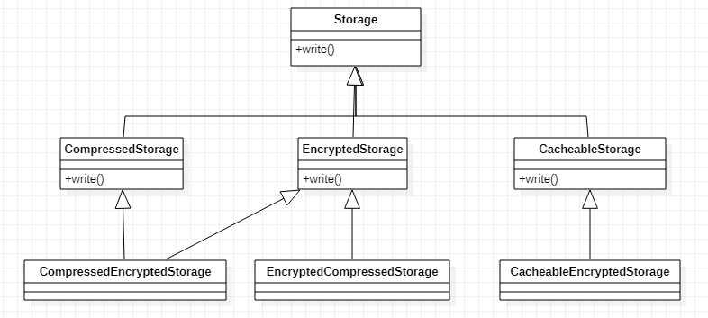
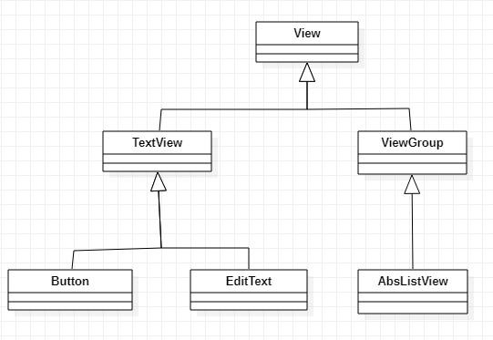

# 상속을 통한 재사용의 단점

## 1. 상위 클래스 변경의 어려움

클래스 상속은 그 클래스에 의존하는 것이다.  
따라서 의존하는 클래스의 코드가 변경되면 상속 받는 클래스는 영향을 받게 된다.  
클래스 계층도가 커질수록 상위 클래스스 변경하는 것은 더 어렵다.

## 2. 클래스의 불필요한 증가

기능 재사용을 위해 상속할 경우 필요한 기능 및 조합이 증가할 수록 클래스의 개수가 불필요하게 증가할 수 있다.



## 3. 상속의 오용

상속 자체를 잘못 사용하는 경우도 있다.

Container 클래스를 정상적으로 사용하려면 제공하는 interface만 사용해야 하지만 잘못된 상속으로 인해
ArrayList의 interface가 사용자에게 노출된다.  
따라서 의도하지 않은 사용으로 프로그램 오류가 발생할 수 있다.

```java
public class Container extends ArrayList<Luggage> {
    private int maxSize;
    private int currentSize;

    public Container(int maxSize) {
        this.maxSize = maxSize;
    }

    public void put(Luggage lug) throws NotEnoughSpaceException {
        if (!canContain(lug))
            throw new NotEnoughSpaceException();
        super.add(lug);
        currentSize += lug.size();
    }

    public void extract(Luggage lug) {
        super.remove(lug);
        this.currentSize -= lug.size();
    }

    public boolean canContain(Luggage lug) {
        return maxSize >= currentSize + lug.size();
    }

}

Luggage size3Lug = new Luggage(3);
Luggage size2Lug = new Luggage(2);
Luggage size1Lug = new Luggage(1);

Container c = new Container(5);
if(c.contain(size3Lug)) {
    c.put(size3Lug);
}
if(c.contain(size2Lug)) {
    c.add(size2Lug); // 비정상 사용
}
if(c.contain(size1Lug)) {
    // 비정상 사용
    c.add(size1Lug); // 통과됨! 의도대로 put을 사용했다면 통과되지 않아야함
}

```

상속은 IS - A 관계가 성립할 때만 사용해야 한다.  
Container는 ArrayList이다. 는 IS - A 관계가 아니다.  
Container는 수화물을 보관하는 책임을 갖는 반면에, ArrayList는 목록을 관리하는 책임을 갖는다.  
즉, 둘은 서로 다른 책임을 갖는다.  
**이렇게 같은 종류가 아닌 클래스의 구현을 재사용하기 위해 상속을 받게 되면, 잘못된 사용으로 인해 문제가 발생한다.**

# 조립을 이용한 재사용

객체 조립(composition)은 여러 객체를 묶어서 더 복잡한 기능을 제공하는 객체를 만든다.  
보통 필드에서 다른 객체를 참조하는 방식으로 구현된다.

**상속의 문제점 중 클래스의 불필요한 증가 예제를 조립을 이용한 재사용으로 표현하면 다음과 같다**

## 조립의 장점

1. 기능이 추가될 때마다 Storage 클래스를 상속받은 하위 클래스가 증가했던 방식과 다르게 조립을 이용하면 불필요한 클래스 증가를 방지할 수 있다.

```java
public class FlowController {
    private Encryptor encryptor = new Encryptor();

    public void process() {
        byte[] encryptedData = encryptor.encrypt(data);
    }
}
```


2. 런타임에 조립 대상 객체를 교체할 수 있다. (상속의 경우 소스 코드를 작성할 때 관계가 형성되기 때문에 런타임에 상위 클래스를 교체할 수 없다.)

```java
public class Storage {...}
public class CompressedStorage extends {...}
public class CompressedEncryptedStorage extends CompressedStorage {...}

// 사용 코드
CompressedEncryptedStorage storage = new CompressedEncryptedStorage();
// 런타임에서 CompressedEncryptedStorage가 사용하는 압축 알고리즘을 변경할 방법이 없다.
```

```java
// 조립 방식은 얼마든지 런타임에 교체 가능하다.
public class Storage {
    private Compressor compressor = new Compressor();
    public void setCompressor(Compressor compressor) {
        this.compressor = compressor
    }

    public void save(FileData fileData) {
        byte[] compressedByte = compressor.compress(fileData.getInputStream());
    }
}

Storage storage = new Storage();
storage.save(someFileData); // Compressor 객체로 압축

storage.setCompressor(new FastCompressor());
storage.save(anyFileData); // FastCompressor 객체로 압축
```

3. 클래스 변경이 용이하다. - Compressor 클래스, Encryptor 클래스는 Storage 클래스에 의존하지 않으므로 Storage 클래스를 쉽게 변경할 수 있다.

## 조립의 단점

- 상대적으로 런타임 구조가 복잡해짐
- 상속보다 구현이 어렵다.

# 위임

내가 할 일을 다른 객체에게 넘기는 것 - 재사용

```java
public abstract class Figure {
    public boolean contains(Point point) {
        Bounds bounds = new Bounds(x, y, width, height);
        return bounds.contains(point.getX(), point.getY());
    }
}
```

# 상속은 언제 사용하나

재사용이 아닌 기능의 확장이라는 관점에서 사용해야 한다.(IS - A 관계일 때)
하위로 내려갈수록 상위 클래스의 기본적인 기능을 그대로 유지하면서 그 기능을 확장한다.

안드로이드의 UI 위젯과 관련된 클래스들의 클래스 계층도 중 일부이다.  
View 클래스는 화면에 보이는 UI 위젯을 표현하는 클래스이다.  
화면에 보이는 텍스트, 버튼, 목록 등은 모두 UI 위젯이므로 명확한 IS - A 관계이다.  
ex. "버튼은 UI 위젯이다" 이므로 직간접적으로 View 클래스를 상속받고 있다.

