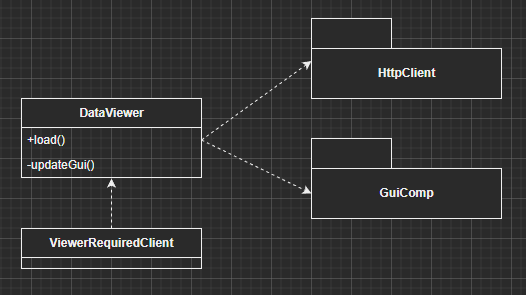
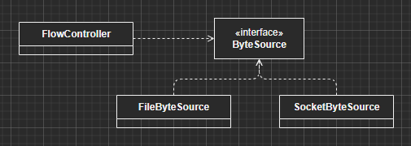
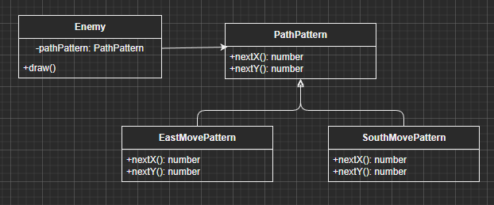
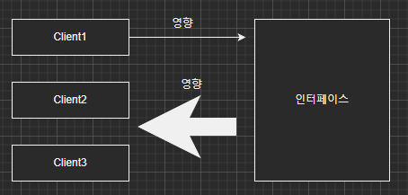
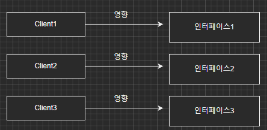

# 단일 책임 원칙(Single Responsibility Principle) - SRP

## 정의

클래스는 단 한 개의 책임을 가져야 한다.

- 한 개의 책임이란 변경될 이유가 하나라는 것

그렇다면 변경될 이유는 누가 정하는 것인가?
이 객체를 사용하는 액터에 의해서 정해진다.

객체에 해당 변경을 요청하는 사용자들의 집단을 액터라고 한다.  
ex) 개발 기획 운영 조직이 있을 때 각 역할이 액터라고 할 수 있다. 이 액터는 다른 요구사항과 기대치를 갖고 있다.

## 책임이란 변경에 대한 것

만약에, 한 클래스가 서로 다른 이유로 변경된다면 여러 책임을 가지고 있다는 것을 의미 한다.


## 단일 책임 원칙 위반 시 문제점

- 유지보수의 어려움
- 재사용의 어려움

1. 유지보수의 어려움

```typescript
class DataViewer {
    constructor(private url: string) {}

    public display(): void {
        const data: string = loadHtml();
        updateGui(data);
    }

    public loadHtml(): string {
        const client: HttpClient = new HttpClient();
        client.connect(url);
        return client.getResponse();
    }

    private void updateGui (data: string) {
        const guiModel: GuiData = parseDataToGuiData(data);
        tableUI.changeData(guiModel);
    }
    private parseDataToGuiData(data: string): GuiData {
        // ... 처리 로직
    }
}
```

데이터를 읽어 오는 기능이 변함  
HTTP Client -> 소켓 기반의 프로토콜로 변경

```typescript
class DataViewer {
    constructor(private server: string, private port: string) {

    public display(): void { // 영향
        const data: string[] = loadHtml();
        updateGui(data);
    }

    public loadHtml(): string[] { // 영향
        const client: SocketClient = new SocketClient();
        client.connect(server, port);
        return client.read();
    }

    private void updateGui (data: string[]) { // 영향
        const guiModel: GuiData = parseDataToGuiData(data);
        tableUI.changeData(guiModel);
    }
    private parseDataToGuiData(data: string[]): GuiData { // 영향
        // ... 처리 로직
    }
}
```

위의 예시에서는 두 개의 책임 - 데이터 읽기, 화면에 보여주기가 섞여 있었습니다.  
이렇듯 책임의 개수가 많을 수록 한 책임의 기능 변화가 다른 책임에 주는 영향은 비례해서 증가합니다.  
이는 유지 보수 어려움으로 이어집니다.

2. 재사용의 어려움

- Viewer 기능이 필요한 ViewerRequiredClient 클래스를 만들었을 때 DataViewer를 의존하게 되면 필요 없는 HttpClient 파일까지 필요하다. -> 불필요한 번들 파일의 용량 증가
- ViewerRequiredClient에서 DataViewer를 사용하기 위해 불필요한 생성자 정보를 넣어줘야함

  - 유지보수 저하 (코드 가독성 저하 / 원하는대로 동작하는지 확인하기 어려움)

  

## 책임은 어떻게 부여할 수 있는가?

Top -> Down 방식으로 초기 설계부터 책임을 부여할 수 있는가?  
액터 -> 패키지 다이어그램 -> 클래스 다이어그램 -> 구현

초기 설계에 책임을 분류 할 수 있으면 좋겠지만 구현의 한계, 요구 사항의 변경 등으로 인해 설계 초기에 책임을 적절히 분리하는것은 쉽지 않다.

따라서, Bottom -> UP 방식으로 진행될 수 있다.  
구현 -> 리팩토링 -> 액터 구별의 반복

## 단일 책임 원칙을 확인하는 방법

클래스 사용자들이 클래스에 기대하는 역할이 각각 다르다면 해당 클래스에 서로 다른 책임이 부여되었을 가능성이 높다.  
따라서, 책임 분리 후보가 될 수 있다.

ex) GUIApplication은 DataViewer에게 보여주는 역할을 기대한다. / DataProcessor는 DataViewer에게 데이터를 가져오는 역할을 기대한다.

ref:

- https://blog.cleancoder.com/uncle-bob/2014/05/08/SingleReponsibilityPrinciple.html
- https://youtube.com/watch?v=AdANHDp5dTM&feature=share

# 개방 폐쇄 원칙(Open - Closed Principle) - OCP

## 정의

확장에는 열려 있어야 하고, 변경에는 닫혀 있어야 한다.  
다시 말해, 기능을 사용하는 코드는 수정하지 않으면서 기능을 변경하거나 확장할 수 있어야 한다.

## 구현 방법

1. **추상화**

추상화를 이용한 개방 폐쇄 원칙 구현 모습이다.  
추후에 MemoryByteSource라는 기능이 추가 되더라도  
FlowController의 경우 추상화된 ByteSource에 의존하고 있으므로 코드 변경에는 닫혀있다.  
MemoryByteSource는 ByteSource를 새로 구현하면 되므로 기능의 확장에는 열려있다고 할 수 있다.

추상화를 통해 개방 폐쇄 원칙을 구현할 수 있는 이유는 변화되는 부분을 추상화했기 때문이다.  
FlowController에서 잘 변하지 않는 인터페이스를 의존 하므로 관련 기능이 확장되더라도 FlowController는 영향을 받지 않는다


2. 상속

```typescript
class ResponseSender {
  constructor(private data: Data) {}

  public send(): void {
    sendHeader()
    sendBody()
  }

  protected sendHeader() {
    // 헤더 데이터 전송
  }

  protected sendBody() {
    // 텍스트로 데이터 전송
  }
}

// ResponseSender는 변경에 닫혀 있다.
// ZippedResponseSender는 확장에 열려 있다.
class ZippedResponseSender extends ResponseSender {
  constructor(data: Data) {
    super(data)
  }

  protected sendBody(): void {
    // 데이터 압축 처리
  }
}
```

## 개방 폐쇄 원칙이 깨질 때의 주요 증상

추상화와 다형성을 이용해서 개방 폐쇄 원칙을 구현한다.  
만일, 추상화와 다형성이 지켜지지 않으면 개방 폐쇄 원칙이 깨진다.

1. 타입 확인 및 특정 타입 특수 처리

```typescript
class Character {
  draw() {}
}

class Player extends Character {
  draw() {}
}

class Missile extends Character {
  draw() {}

  drawSpecific() {}
}

/*
    해당 코드는 추상화와 다형성이 잘 지켜지지 않았다.
    따라서 Missile 코드 변경 시 drawCharacter도 변경되므로 변경에 닫혀있지 않게 된다.
      
    만일, drawSpecific 메서드가 객체마다 변화되는 대상이라면 Character로 올려야 한다.  
*/
function drawCharacter(character: Character) {
  if (character instanceof Missile) {
    // 타입 확인
    missile.drawSpecific() // 별도 처리
  } else {
    character.draw()
  }
}
```

2. 비슷한 if - else 블록이 존재한다.  
   Enemy 캐릭터의 움직이는 경로를 몇 가지 패턴으로 정한다.  
   이때, 정해진 패턴에 따라 경로를 이동하는 코드는 다음과 같다.

```typescript
class Enemy extends Character {
  constructor(private pathPatern: number) {}

  public draw(): void {
    // 새로운 경로 패턴이 추가되면 해당 메서드도 영향을 받는다.
    // 이는 Enemy 클래스가 변경에 닫혀있지 않으므로 개방 폐쇄 원칙이 깨진것이다.
    if (this.pathPattern === 1) {
      x += 4
    } else if (this.pathPattern === 2) {
      y += 10
    } else if (this.pathPattern === 4) {
      x += 4
      y += 10
    }
    // 그리는 코드
  }
}
```

다음과 같은 구조로 개방 폐쇄 원칙을 지킬 수 있다.


```typescript
class Enemy extends Character {
  constructor(private pathPatern: pathPattern) {}

  public draw(): void {
    const x = this.pathPattern.nextX()
    const y = this.pathPattern.nextY()
    // 그리는 코드
  }
}
```

## 개방 폐쇄 원칙은 유연함에 대한 것

기존 기능을 확장하기 위해 코드를 수정해주어야 한다면, 새로운 기능을 추가하는 것이 점점 힘들어진다.  
확장에는 닫히고 변경에는 열리게 되면서 유지보수가 힘들어진다.

개방 폐쇄 원칙은 변화되는 부분을 추상화해서 사용자 입장에서 변화를 고정시킨다.

상속을 이용하더라도 부모 클래스는 변경에 닫혀있으면서 자식 클래스에서 기능을 확장하도록 한다.

# 리스코프 치환 원칙(Liskov Substitution Principle) - LSP

개방 폐쇄 원칙을 받쳐 주는 다형성에 관한 원칙을 제공한다.  
상위 타입의 객체를 하위 타입의 객체로 치환해도 상위 타입을 사용하는 프로그램은 정상적으로 동작해야 한다.

## 리스코프 치환 원칙을 지키지 않을 때의 문제

```typescript
class Rectangle {
  private width: number
  private height: number

  public setWidth(width: number) {
    this.width = width
  }

  public setHeight(height: number) {
    this.height = height
  }

  public getWidth() {
    return this.width
  }

  public getHeight() {
    return this.height
  }
}

class Square extends Rectangle {
  public setWidth(width: number) {
    super.setWidth(width)
    super.setHeight(width)
  }

  public setHeight(height: number) {
    super.setWidth(height)
    super.setHeight(height)
  }
}

function increaseHeight(rec: Rectangle) {
  if (rec instanceof Square) {
    throw new Error("Can not support square")
  }

  if (rec.getHeight() <= rec.getWidth()) {
    // height가 width 작으면 height 증가 하지만, square 는 width, height가 같으므로 특수 처리
    rec.setHeight(rec.getWidth() + 10)
  }
}
```

위 예시처럼 직사각형 - 정사각형 문제는 개념적으로 상속 관계처럼 보여도 실제 구현에서는 상속 관계가 아닐 수 있다는 것을 보여준다.  
increateHeight에서 Square를 별도처리한 다는 것은 상속을 통한 다형성을 해치는 것이다.  
즉 Square는 다른 타입으로 구현해야 한다.

## 리스코프 치환 원칙이 위배되는 경우

instanceof로 타입을 확인하는 것은 리스코프 치환 원칙이 위배되었을 가능성이 높다.

### **리스코프 치환 원칙 위배 유형**

- 상속 관계로 묶을 수 없는 경우
  - 정사각형 - 직사각형 문제
- 명세를 잘 지키지 않은 경우
  - 명세에서 벗어난 값 리턴, 익셉션 발생, 다른 기능 수행 등
- 추상화가 덜 된 경우

  ```typescript
  class Coupon {
    calculateDiscountAmount(item: Item) {
      if (item instanceof SpecialItem)
        // LSP 위반 발생
        return 0
      return item.getPrice() * discountRate
    }
  }
  ```

  할인되지 않는 상품 타입이 추가되었다는 것은 이후에 비슷한 요구가 발생할 가능성이 높음을 뜻한다.  
  에를 들어, 신규 상품은 한 달간 할인이 안된다 등.  
  따라서 상품의 가격 할인 가능 여부가 Item 및 하위 타입에서 변화되는 부분이므로 해당 가격 할인 여부를 Item 상위 타입에 추가해야 한다.

  ```typescript
  class Item {
    isDiscountAvailable() {
      return true
    }
  }

  class SpecialItem extends Item {
    isDiscountAvailable() {
      return false
    }
  }
  class Coupon {
    calculateDiscountAmount(item: Item) {
      if (item.isDiscountAvailable()) return 0
      return item.getPrice() * discountRate
    }
  }
  ```

  이렇듯, 리스코프 치환 원칙이 잘 지켜지지 않으면 개방 폐쇄 원칙을 지킬 수 없다.  
   즉, 기능을 확장하기가 어렵다.

# 인터페이스 분리 원칙 (Interface Segregation Principle) - ISP

인터페이스는 그 인터페이스를 사용하는 클라이언트를 기준으로 분리해야 한다.  
각 클라이언트가 사용하는 기능을 중심으로 인터페이스를 분리함으로써, 클라이언트로부터 발생하는 인터페이스 변경의 여파가 다른 클라ㅣ언트에 미치는 영향을 최소화할 수 있게 된다.  




# 의존 역전 원칙 (Dependency Inversion Principle) - DIP

고수준 모듈은 저수준 모듈의 구현에 의존해서는 안 된다. 저수준 모듈이 고수준 모듈에서 정의한 추상 타입에 의존해야 한다.

**고수준 모듈 **
어떤 의미 있는 단일 기능을 제공하는 모듈
ex. 바이트 데이터를 읽어와 암호화 하고 결과 바이트 데이터를 쓴다.

**저수준 모듈**
고수준 모듈의 기능을 구현하기 위해 필요한 하위 기능의 실제 구현
ex. 파일에서 바이트 데이터를 읽어 온다. AES 알고리즘으로 암호화한다. 파일에 바이트 데이터를 쓴다.

## 고수준 모듈이 저수준 모듈에 의존할 때의 문제

고수준 모듈은 상대적으로 큰 틀에서 프로그램을 다룬다면, 저수준 모듈은 각 개별 요소를 어떻게 구현할지에 대해서 다룬다.  
프로젝트 초기에 요구사항이 안정화되면 이후부터는 고수준 모듈 보다 저수준 모듈이 변경될 가능성이 높다.

예를 들어, 상품의 가격을 결정하는 정책이 다음과 같다.

- 쿠폰을 적용해서 가격 할인을 받을 수 있다.
- 쿠폰은 동시에 한 개만 적용 가능하다.

이는 고수준 모듈의 정책이다.  
저수준 모듈이 다루게 될 상세 내용으로는 금액 할인 쿠폰 / 비율 할인 쿠폰 등 다양한 쿠폰 종류를 구현해야 할 수 있다.

이때, 쿠폰을 이용한 가격 계산 모듈이 쿠폰 구현에 의존하게 되면 유지보수를 어렵게 만든다.  
쿠폰 구현이 변경되면 가격 계산 모듈도 변경되기 때문이다.

유지보수를 쉽게 하기 위해서는 개방 폐쇄 원칙 처럼 고수준 모듈은 변경하지 않으면서 저수준 모듈에서 확장하도록 해야 한다.  
이를 위해 의존 역전 원칙을 적용해야 한다.

## 의존 역전 원칙을 통한 변경의 유연함 확보

의존 역전 원칙은 이런 문제를 추상화를 통해 저수준 모듈이 고수준 모듈을 의존하게 만들어서 해결한다.  
고수준 모듈인 FlowController와 저수준 모듈인 FileDataReader가 모두 추상화 타입인 ByteSource에 의존함으로써, 우리는 고수준 모듈의 변경 없이 저수준 모듈을 변경할 수 있는 유연함을 얻게 되었다.  
즉, 의존 역전 원칙은 리스코프 치환 원칙과 함께 개방 폐쇄 원칙을 만들어주는 기반이 되는 것이다.


# SOLID 정리

SOLID 원칙은 변화에 유연하게 대처할 수 있는 설계 원칙이다.  
즉, 좋은 유지보수를 위한 것이다.

단일 책임 원칙과 인터페이스 분리 원칙은 객체가 커지지 않도록 막아준다. 객체가 많은 기능을 가지게 되면, 객체가 가진 기능의 변경 여파가 그 객체의 다른 기능에까지 번지게 되고 이는 다시 다른 기능을 사용하는 클라이언트에게까지 영향을 준다.

리스코프 치환 원칙과 의존 역전 원칙은 개방 폐쇄 원칙을 지원한다.  
개방 폐쇄 원칙은 변화되는 부분을 추상화하고 다형성을 이용함으로써 기능 확장을 하면서도 기존 코드를 수정하지 않도록 만들어 준다.  
여기서, 변화되는 부분을 추상화할 수 있도록 도와주는 원칙이 바로 의존 역전 원칙이고, 다형성을 도와주는 원칙이 리스코프 치환 원칙이다.

SOLID 원칙은 사용자 관점에서의 설계를 지향하고 있다.
