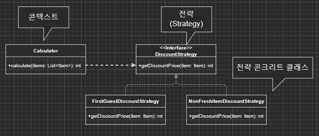
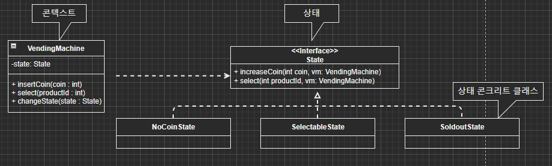

# 디자인 패턴이란?

객체 지향 설계를 하다 보면, 비슷한 상황에서 사용했던 설계를 재사용하는 경우가 종종 있다.  
이런 **설계는 특정 상황에 맞는 해결책을 빠르게 찾을 수 있도록 도와주는데, 이렇게 반복적으로 사용되는 설계는 클래스, 객체의 구성, 객체 간 메시지 흐름에서 일정 패턴을 갖는다.**

## 디자인 패턴 습득 시 이점

- 상황에 맞는 올바른 설계를 더 빠르게 적용할 수 있다.
- 각 패턴의 장단점을 통해서 설계를 선택하는데 도움을 얻을 수 있다.
- 설계 패턴에 이름을 붙임으로써 시스템의 문서화, 이해, 유지 보수에 도움을 얻을 수 있다.

## 전략(Strategy) 패턴

- 정의
  - 특정 콘텍스트에서 알고리즘을 별도로 분리하는 설계 방법
  - 콘텍스트는 사용할 전략을 직접 선택하지 않고 DI를 이용해서 전략을 주입 받는다.
  - 전략이 어떤 메서드를 제공할 지의 여부는 콘텍스트가 전략을 어떤 식으로 사용하느냐에 따라 달라진다.
- 사용시점

  - if-else로 구서된 코드 블록이 비슷한 기능을 수행하는 경우
  - 성능의 장단점에 따라 알고리즘을 선택해야 하는 경우

- 사용효과

  - 컨텍스트 외부에서 전략을 쉽게 변경할 수 있다.

- 패턴 적용 대상

**문제점**  
서로 다른 계산 정책들이 한 코드에 섞여 있어, 정책이 추가될 수록 코드 분석을 어렵게 만든다.

```java
public class Calculator {
    public int calculate (boolean firstGuest, List<Item> items) {
        int sum = 0;
        for (Item item : items) {
            if (firstGuest) {
                sum += (int) (item.getPrice() * 0.9) // 첫 손님 10% 할인
            } else if (!item.isFresh()) {
                sum += (int) (item.getPrice() * 0.8) // 덜 신선한 것 20% 할인
            } else {
                sum += item.getPrice();
            }
        }

        return sum;
    }
}
```

- 패턴 적용  
  

```java
public class Calculator {
    public DiscountStrategy discountStrategy;

    public Calculator(DiscountStrategy discountStrategy) {
        this.discountStrategy = discountStrategy;
    }

    public int calculate (List<Item> items) {
        int sum = 0;
        for (Item item : items) {
            sum += discountStrategy.getDiscountPrice(item);
        }

        return sum;
    }
}
```

## 템플릿 메서드(Template Method) 패턴

1. 정의

   - 상위 클래스에서 알고리즘의 골격(동작 방식 구조)을 정하고 알고리즘의 여러 단계 중 일부는 하위클래스에서 재정의하는 패턴

2. 구성요소
   - AbstractClass
     - 템플릿 메서드를 정의한다.
     - 하위 클래스에서 사용된 추상 메서드를 선언한다.
     - 템플릿 메서드는 기능을 구현할 때 추상 메서드를 호출하여 사용한다.
   - ConcreteClass
     - AbstractClass에서 선언되어 있는 추상 메서드를 구현한다.
3. 사용시점
   - 여러 단계를 가진 알고리즘의 골격이 존재한다.
   - 알고리즘의 일부 특정단계에서 상황별로 차이가 난다.
   - 전체적으로 동일하면서 부분적으로는 다른 구문으로 구성된 코드 블록이 중복된다.
   - 일정한 절차를 가지고 함수의 몸체가 크다.
   - 메서드의 몸체가 크고 일정한 절차를 가진 알고리즘의 골격이 존재한다.
   - 하위클래스에 상위클래스의 메서드와 유사한 메서드가 존재한다.
   - 하위클래스에 상위클래스의 메서드로 구성된 메서드가 존재한다.
4. 사용호과
   - 비슷한 형태의 애플리케이션 제작에 필요한 알고리즘 골격을 일반화하여 재사용할 수 있다.
   - 차이가 나는 부분만 재정의함으로써 코드 중복 문제를 해결할 수 있다.
5. 사용예
   - 프레임워크의 전체 알고리즘을 만들 때 사용된다.
   - 애플리케이션의 뼈대를 만드는 작업에서 많이 사용된다.

전략 패턴과 조합하여 사용할 경우 상속을 기반에 두지 않고 조립/위임을 사용하여 런타임에 템플릿 메서드에서 사용할 객체를 교체할 수 있는 장점을 갖게 된다.

## 상태(State) 패턴

1. 정의
   - 상태에 의존적인 객체를 상태관점에서 따로 분리하여 객체의 행동을 다루는 패턴
2. 클래스 다이어그램
   - 
3. 사용시점
   - 객체의 행동에 영향을 미치는 객체의 속성 '상태'가 존재한다.
   - 상태값을 저장하기 위한 인스턴스 변수를 만들고, 메서드 내에서는 조건문을 써서 다양한 상태를 처리한다.
   - 상태에 따라 동일한 기능 요청의 처리를 다르게 함
   - 함수 안에 case나 if-else가 중복될 때
4. 사용효과
   - 각 상태의 행동을 별개의 클래스로 국지화 - 코드를 수정하거나 이해하기가 쉬워짐
   - 관리하기 힘든 골칫덩어리 if 선언문들을 없앰
   - 특정 형식의 상태 추가나 삭제를 빠르고 유연하게 대처할 수 있게 됩니다.
   - 새로운 상태가 추가되더라도 컨텍스트 코드가 받는 영향은 최소화된다.
   - 상태에 따른 동작을 구현한 코드가 각 상태 별로 구분되기 때문에 상태별 동작을 수정하기 쉽다.
5. 사용예
   - ECount Report에서 resizable, moveable, editable 상태에 따라 다르게 처리

### 상태 패턴 예시

요구 사항
| 동작 | 조건 | 실행 | 결과 |
| ---------------- | ------ | --------- | ------- |
| 동전을 넣음 | 동전 없음이면 | 금액을 증가 | 제품 선택 가능 |
| 동전을 넣음 | 제품 선택 가능이면 | 금액을 증가 | 제품 선택 가능 |
| 제품 선택 | 동전 없음이면 | 아무 동작 하지 않음 | 동전 없음 유지 |
| 제품 선택 | 제품 선택 가능이면 | 제품 주고 잔액 감소 | 잔액 있으면 제품 선택 가능 / 잔액 없으면 동전 없음 |

```java
public class VendingMachine {
  public static enum State { NOCOIN, SELECTABLE }

  private State state = State.NOCOIN;

  public void insertCoin(int coin) {
    switch(state) {
      case NOCOIN:
        increaseCoin(coin);
        state = State.SELECTABLE;
        break;
      case SELECTABLE:
        increaseCoin(coin);
    }
  }

  public void select (int productId) {
    switch(state) {
      case NOCOIN:
        break;
      case SELECTABLE:
        provideProduct(productId);
        decreaseCoin();
        if (hasNoCoin()) {
          state = State.NOCOIN;
        }
    }
  }

  // increaseCoin, provideProduct, decreaseCoin 구현
}
```

**문제점**  
상태 증가에 따라 조건문이 여러 코드에 중복 추가되어 코드가 복잡해 진다.  
이는 유지보수 어려움으로 이어진다.

상태에 따라 다르게 동작해야 할 때 상태 패턴을 활용할 수 있다.

**상태 패턴 적용**

```java
public class VendingMachine {
private State state;

public VendingMachine () {
  state = new NoCoinState();
}

public void insertCoin(int coin) {
  state.increaseCoin(coin, this); // 상태 객체에 위임
}

public void select (int productId) {
  state.select(productId, this) // 상태 객체에 위임
}

public void changeState(State newState) {
  this.state = newState;
}

// 기타 다른 기능
}

public class NoCoinState implements State {
@Override
public void increaseCoin(int coin, VendingMachine vm) {
  vm.increaseCoin(coin);
  vm.changeState(new SelectableState());
}

@Override
public void select(int productId, VendingMachine vm) {
  SoundUtil.beep();
}
}

public class SelectableState implements State {
@Override
public void increaseCoin(int coin, VendingMachine vm) {
  vm.increaseCoin(coin);
}

@Override
public void select(int productId, VendingMachine vm) {
  vm.provideProduct(productId);
  vm.decreaseCoin();

  if (vm.hasNoCoin()) {
    vm.changeState(new NoCoinState());
  }
}
}
```

### 이점

OCP 원칙이 잘 적용되어 VendingMachine은 변경에 닫혀 있고 상태 확장에는 열려있다.  
또한, 상태에 대한 동작 수정 시 해당 상태를 처리하는 클래스만 수정할 수 있다.

### 상태 변경은 누가?

**콘텍스트**

- 상태 변경 규칙을 한번에 확인
- 상태 개수가 적고 변경 규칙이 거의 바뀌지 않는 경우

만일, 상태 변경이 자주 일어난다면 상태 변경 처리 코드가 복잡해질 가능성이 높다.

```java
 public class VendingMachine {
  private State state;

  public VendingMachine () {
    state = new NoCoinState();
  }

  public void insertCoin(int coin) {
    state.increaseCoin(coin, this);
    if (hasCoin()) {
      changeState(new SelectableState());
    }
  }

  public void select (int productId) {
    state.select(productId, this)
    if (state.isSelectable() && hasNoCoin()) {
      changeState(new NoCoinState());
    }
  }

  private void changeState(State newState) {
    this.state = newState;
  }

  private boolean hasCoin() {
    // ...
  }

  private boolean hasNoCoin() {
    return !hasCoin();
  }

  // 기타 다른 기능
}
```

**상태 객체**

- 상태 변경 규칙을 각 상태 객체로 분리하고 싶은 경우

상태 변경 규칙이 여러 클래스에 분산되어 있어 규칙을 파악하기 어렵다.  
한 상태 클래스에서 다른 상태 클래스에 대한 의존도 발생

## State 패턴과 Strategy 패턴의 차이점

- State 패턴은 상태를 가지는 객체가 내부적으로 상태에 따라 로직을 분리해서 사용한다.
- Strategy 패턴은 클라이언트가 객체의 행위(전략)를 변경할 수 있다.
