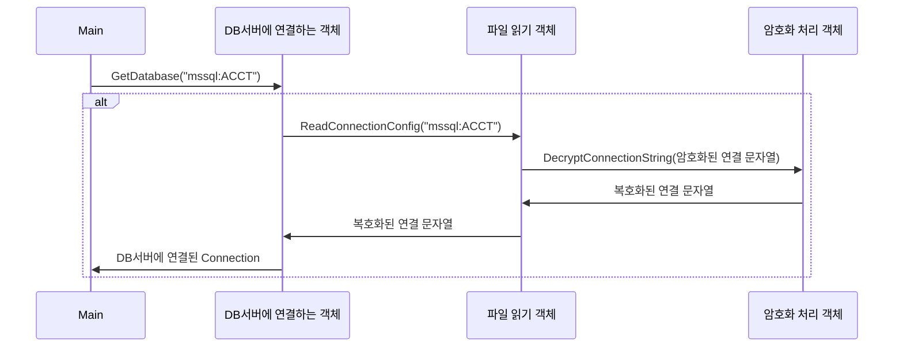

## Chapter2. 객체 지향 - 객체(Object) 

2. 객체(Object)  
2-1. 객체의 핵심은 기능을 제공하는 것  
2-2. 인터페이스와 클래스   
2-3. 메시지   

</br>

> 1. 개념 정리 
> - 객체는 기능을 제공
> - 기능 = `[1] 오퍼레이션`
> - 기능의 집합 (= 오퍼레이션의 집합) = `[2] 인터페이스` = 기능 명세서
> - `[3] 클래스` = 기능 구현
> - 다른 객체에 오퍼레이션 실행을 요청 = `[4] "메시지`를 보낸다"

</br>

### [1] 오퍼레이션

- 객체의 `기능` 
- c#/java, `메써드`에 대응
- 3가지 구성 요소  
 (1) 메써드명  
 (2) 파라미터 및 파라미터 타입  
 (3) 리턴값   
  => `시그니처(;Signature)`  
 
- 오퍼레이션 예시
```text 
ex. connection.conf 파일에서 "mssql:ACCT"라는 커넥션 아이디에 해당하는 `연결 문자열을 읽어온 후`
연결 문자열 중 password를 `복호화`하고
복호화된 연결문자열로 `DB서버에 연결`한다.
```  
  
📘 파일 읽기 객체 <br/> 

|오퍼레이션명|파라미터|결과|
|---|---|---|
|ReadConnectionConfig()|커넥션 아이디|복호화된 연결 문자열|

📘 암호화 처리 객체 <br/> 

|오퍼레이션명|파라미터|결과|
|---|---|---|
|DecryptConnectionString()|암호화된 연결 문자열|복호화된 연결 문자열|

📘 DB서버에 연결하는 객체 <br/> 

|오퍼레이션명|파라미터|결과|
|---|---|---|
|GetDatabase()|커넥션 아이디|DB 연결 객체|  
  


=> 객체는 오퍼레이션들로 구성/정의되어 있고, 각 `오퍼레이션은 자신만의 signature를 갖는다.`   
=> 객체의 오퍼레이션을 사용하려면, 해당 기능의 `signature를 알아야` 한다. 

</br></br>

### [2] 인터페이스

- 오퍼레이션 집합
- 객체가 제공하는 **오퍼레이션을 사용하기 위한 명세서**

</br></br>

### [3] 클래스
- 오퍼레이션을 구현
- p.34 *"인터페이스는 객체가 제공하는 기능에 대한 명세서일 뿐, 실제 기능을 구현하는 것은 클래스이다."*

</br></br>

### [4] 메시지 
- 다른 객체에 오퍼레이션 실행을 요청한다. = `메시지를 보낸다.`
- c#과 같은 언어에서는 메써드 호출을 의미   

[Click](#오퍼레이션-예시)   
  
