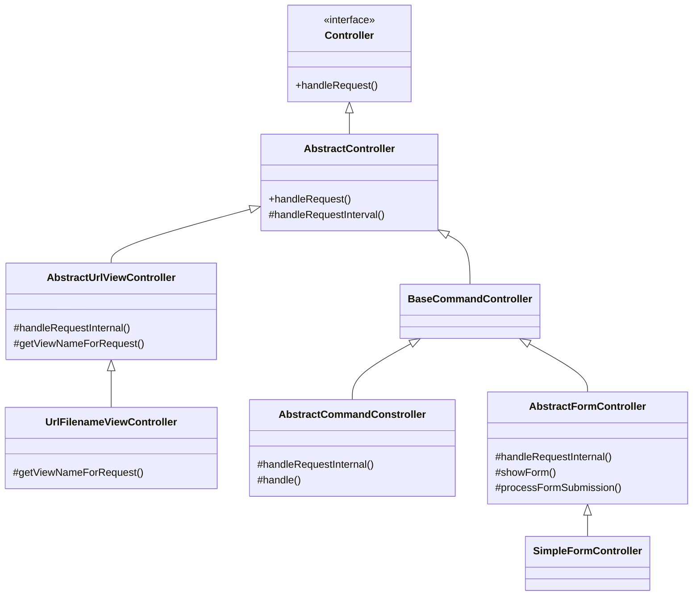
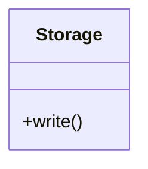
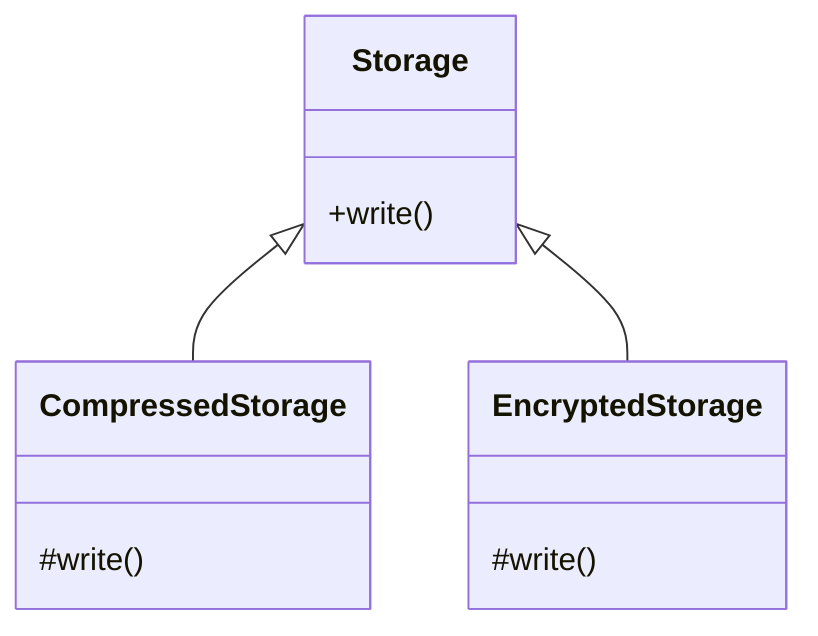
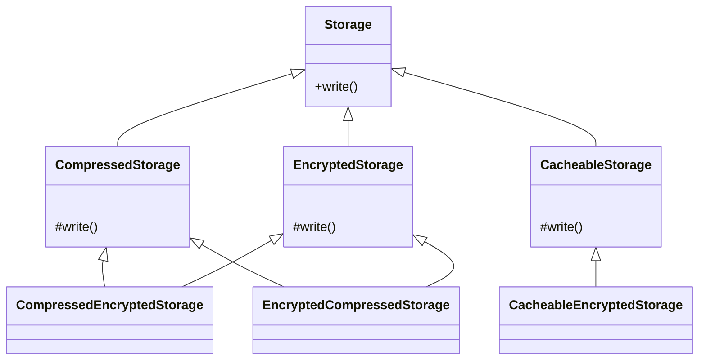

# Chapter4. 재사용: 상속보단 조립

> 1. 상속과 재사용   
1.1. 상속을 통한 재사용의 단점 1. 상위 클래스 변경의 어려움  
1.2. 상속을 통한 재사용의 단점 2. 클래스의 불필요한 증가      
1.3. 상속을 통한 재사용의 단점 3. 상속의 오용     
> 2. 상속과 재사용   
2.1. 위임    
2.2. 상속은 언제 사용하나?     

</br>

## 목차   

[개요](#개요)  
</br>
1. [캡슐화 손상](#1-캡슐화-손상)  
2. [결합도 증가](#2-결합도-증가)  
3. [클래스 폭발(= 조합의 폭발) 문제](#3-클래스-폭발-문제)  
4. [상속 오용의 문제](#4-상속-오용의-문제)  

</br> 

## 개요
### 1. 상속?
- inheritance
- 객체들 간의 관계를 구축하는 방법  
- 기존 클래스에 `기능을 추가`하거나 `재정의`하여 새로운 클래스를 정의하는 것.  

### 2. 상속의 장점? 
- 기존 클래스의 속성(자료/함수) 재사용  
⇒ 코드를 재사용할 수 있다.  
⇒ 중복 코드 감소.  

- 다형성 구현 가능.  
- 클래스 간의 계층적 분류를 통해, 클래스들의 구조적 관계 파악 용이.  

### 3. 상속의 문제점 및 한계점? 
> *"상속은 마냥 좋은 것인가?"*
🙅‍♀️  

</br>

- 상속은 중복을 제거하기에 아주 좋은 객체지향 기술로 보인다.   
- 하지만, 상속이 갖는 단점은 상당히 치명적이기 떄문에, 상속을 사용해야 하는 경우는 선택적이다.   
- 그렇다면, 상속으로 인해 발생할 수 있는 문제점은 무엇인가?   

</br>

## 1. 캡슐화 손상
1) 캡슐화(; encapsulation)
- 객체의 속성과 행위를 하나로 묶고, 
- 실제 내부 구현 내용을 감추어 `은닉한다`.  

2) 오버라이딩
- 오버라이딩은 은닉화의 관점에서 `캡슐화를 손상`시킨다.   
ex.   
```cs
public class Car
{
      public virtual void Run()
      {
            Console.WriteLine("달리다");
      }
}

public class SuperCar : Car
{
      public override void Run()
      {
            Console.WriteLine("빨리 달리다");
      }
}
```
- 부모의 메써드를 자식이 재정의하고 있고  
- 부모 메써드의 구현부가 노출되었고  
- 심지어 아예 새로운 구현부가 만들어진 상황  

=> 은닉화의 관점에서 캡슐화가 손상되었다.

</br></br>

## 2. 결합도 증가
1) 결합도(; coupling)
> *소프트웨어 공학에서 결합도 또는 의존도는 `어떤 모듈이 다른 모듈에 의존하는 정도`를 나타내는 것이다.*  
> *결합도는 보통 응집도과 대비된다.*  
> *낮은 결합도는 종종 높은 응집도와 관련이 있으며, 그 역도 마찬가지이다. (by 위키백과)*  

</br> 

- 상속을 하게되면, 하위 클래스가 상위 클래스에 강하게 의존.  
- 상위 클래스의 메써드 시그니처나 필드 정의가 변경되면, 하위 클래스가 영향을 받게 된다. 

ex. 
```cs
// 상위 클래스
public class Document
{
      public string GetContent()
      {
            // todo...
      }
}

// 하위 클래스
public class CustomDocument : Document 
{
      public string GetCustomDocument()
      {
            string newContent = string.Empty;
            var originContent = GetContent();  // * here.
            // ... 
            
            return newContent;
      }
}
```
- 자식 클래스 내부에서 부모 클래스의 메써드를 직접 호출하고 있다. 
- GetContent() 메써드의 리턴 타입이 string에서 char[]로 바뀌었다면? 
- 계층이 깊은 경우, 최상위 클래스의 변경이 말단 클래스까지 영향을 줄 수 있다.  
   


=> `상속`은 클래스 간 `결합도를 높이고`, 클래스의 응집도는 낮춰  
`자식 클래스를 수동적인 객체로` 만들어버릴 수 있다.  

</br></br>

## 3. 클래스 폭발 문제
- 클래스 폭발; class explosion  
- 조합의 폭발; combinational explosion  
- 유사한 `기능을 확장`하는 과정에서, `클래스 개수가 불필요하게 많아질 수 있다.`     

ex. 
### [1] 
> 파일 보관소를 구현한 Storage 클래스.   


</br> 

### [2]  
|요구사항|새로운 클래스|
|------|---|
|"용량이 부족하니, 파일을 압축해서 저장해줘."|CompressedStorage|
|"보안 강화가 필요하니, 파일을 암호화해서 저장해줘."|EncryptedStorage|  

   


</br> 

### [3]  
|요구사항|새로운 클래스|
|------|---|
|"압축을 먼저하고, 암호화해서 저장해줘."|CompressedEncryptedStorage|
|"암호화를 먼저하고, 압축해서 저장해줘."|EncryptedCompressedStorage|  
|"캐시가 적용된 저장소가 필요해."|CacheableStorage|  
|"암호화된 저장소에 캐시 적용이 필요해."|CacheableEncryptedStorage|  



</br>

- `필요한 기능의 조합이 증가`할수록, 상속을 통한 기능 재사용을 하면 `클래스의 개수는 함께 증가`하게 된다.  
⇒ 클래스 폭발 

</br></br>
  
## 4. 상속 오용의 문제
- 상속 오용의 문제란? : 개발자가 상속 자체를 잘못 사용한 경우   

</br>

- 상속은 `is-a 관계`가 성립할 때만 사용하는 것이 옳다.    
ex. 
*"말티즈 is a 개."*   
*"사과 is a 과일."*  
⇒ `종류가 같을 때만` 상속을 사용하는 것이 옳다.  

</br>

- 같은 종류가 아닌데, 단순히 어떤 클래스의 `구현을 재사용하기 위한 목적으로 상속` 받게 되면, 
- 잘못된 사용으로 인한 문제가 발생할 수 있다.  

ex. 
</br>
* **Luggage** 클래스 (수화물 클래스)  
* **Container** 클래스 (수화물을 보관하는 책임을 가진 클래스)   
  >> 수화물을 넣는다  
  >> 수화물을 뺀다  
  >> 수화물을 넣을 수 있는지 확인한다  

```c#
// 수화물 클래스  
public class Luggage
{
    #region [properties]
    public int Size { get; }
    #endregion

    #region [constructor]
    public Luggage(int size)
    {
        this.Size = size;
    }
    #endregion
}
```
```cs
// 컨테이너 클래스  
public class Container : List<Luggage>
{
    #region [fields]
    private int _maxSize;     // 컨테이너에 보관 가능한 최대 크기  
    private int _currentSize; // 현재 컨테이너에 보관된 총 수화물 크기  
    #endregion 
    
    #region [constructor]
    public Container(int maxSize)
    {
        this._maxSize = maxSize;
    }
    #endregion 

    public bool CanContain(Luggage lug)
    {
        // 현재 컨테이너에 보관된 총 수화물 크기와, 새로운 수화물 크기를 비교하여 
        // 새로운 수화물을 보관할 수 있는지 확인하는 기능.  
        return _maxSize >= _currentSize + lug.Size;
    }
    
    public void Put(Luggage lug)
    {
        if (!CanContain(lug)) {
            throw new Exception("not enough space");
        }

        Add(lug);       //use parent class method
        _currentSize += lug.Size;
    }

    public void Extract(Luggage lug)
    {
        Remove(lug);    //use parent class method
        _currentSize -= lug.Size;
    }
}
```  
```cs
var container = new Container(100);

container.Put(new Luggage(30));
container.Put(new Luggage(80));     // Add로 수정하면?
```

- Put을 Add로 수정하면? 🤦‍♀️  
⇒ Container의 여분 사이즈 계산이 정상적으로 동작하지 않음.  
⇒ 발생해야 하는 오류가 발생하지 않고, 결과적으로 currentSize가 maxSize를 초과하게 됨.    

- 누구의 문제일까?   
⇒ Put()을 사용하지 않고 Add()를 사용한 개발자의 잘못일까?   
⇒ 오용의 여지를 준 Container 클래스 작성자의 잘못일까?   
⇒ 후자.  

- 이런 문제가 발생한 이유가 무엇일까?   
⇒ **Container `is not` a List.**  
⇒ 같은 종류가 아닌데, 단순히 어떤 클래스의 `구현을 재사용하기 위한 목적으로 상속` 받다보니 발생한 문제.    

- 따라서, 상속은 `is-a 관계`가 성립할 때만 사용하는 것이 옳다.    
</br></br>
  
