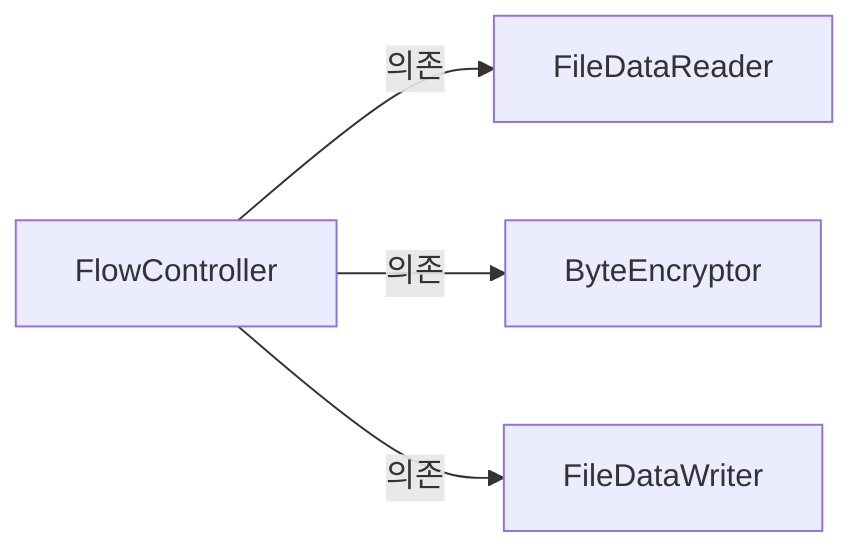
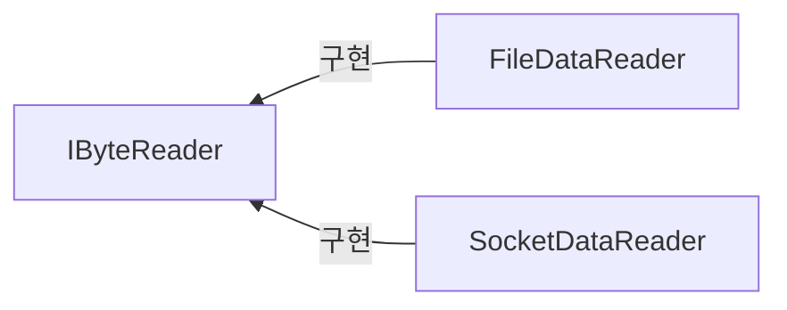

# Chapter5. 설계 원칙: SOLID

>5. 의존 역전 원칙(Dependency Inversion principle)  
5.1. 고수준 모듈이 저수준 모듈에 의존할 때의 문제   
5.2. 의존 역전 원칙을 통한 변경의 유연함 확보        
5.3. 소스 코드 의존과 런타임 의존        
5.4. 의존 역전 원칙과 패키지        

</br>

## 목차   

[개요](#개요)  
</br>
1. [상위 모듈, 하위 모듈](#1-상위-모듈-하위-모듈)  
2. [상위 모듈이 하위 모듈에 의존할 때의 문제](#2-상위-모듈이-하위-모듈에-의존할-때의-문제)  
3. [의존 역전 원칙을 통한 변경의 유연함 확보](#3-의존-역전-원칙을-통한-변경의-유연함-확보)  
4. [소스 코드 의존과 런타임 의존](#4-소스-코드-의존과-런타임-의존)  
5. [의존 역전 원칙과 패키지](#5-의존-역전-원칙과-패키지)  

</br> 

## 개요 	
[의존 관계 역전 원칙](https://ko.wikipedia.org/wiki/%EC%9D%98%EC%A1%B4%EA%B4%80%EA%B3%84_%EC%97%AD%EC%A0%84_%EC%9B%90%EC%B9%99)  

- 상위 모듈은 `하위 모듈에 의존하면 안된다`.   
- 상위와 하위 객체 모두가 `동일한 추상화에 의존`해야 한다.   

</br>
</br>

## 1. 상위 모듈, 하위 모듈 
**1) 상위 모듈(= 고수준 모듈)**   
- 어떤 `의미 있는 단일 기능`을 제공하는 모듈  

**2) 하위 모듈(= 저수준 모듈)**   
- 고수준 모듈의 `단일 기능을 구성하는 하위 기능`을 구현하는 모듈  

**3) 예시** 
- FlowController (상위 모듈) 
>파일에서 바이트 데이터를 읽어와 (→ `하위 기능 1`)  
>암호화 하고  (→ `하위 기능 2`)   
>파일에 결과 데이터를 쓴다.    (→ `하위 기능 3`)   

- FileDataReader (하위 모듈)  
- ByteEncryptor   
- FileDataWriter   


- `상위 모듈이 하위 모듈에 의존`하고 있음.   
- `의존 관계 역전 원칙 위배`하는 사례.   

</br>

- 🙋 상위 모듈이 하위 모듈에 의존하면 안되나?
- 안된다.   

</br>
</br>

## 2. 상위 모듈이 하위 모듈에 의존할 때의 문제 

> FlowController과 FileDataReader의 의존 관계를 코드로 구현한 것  

```c#
public class FileDataReader
{
  public byte[] Read()
  {
    //...
  }
}

public class FlowController 
{
  public void process()
  {
    //(1) 파일에서 읽어오기
    var reader = new FileDataReader();
    byte[] datas = reader.Read();
    
    //(2) 읽어온 데이터를 암호화 
    //(3) 파일에 암호화된 데이터를 쓰기
    //todo...
  }
}
```

- 어떤 문제가 있을까요?  

</br>

- `유지 보수에 취약`하다.    
- 시간이 지나 파일 뿐만 아니라 `소켓`을 통해서도 데이터를 읽어올 수 있도록 해달라는 `새로운 요구사항이 등장`한 경우   
→ 상위 모듈이 수정되어야 한다.  
→ `하위 모듈의 변경이 상위 모듈의 변경을 유발`한다.    
→ `결합도는 높고` 응집도는 낮은 코드이다.  
→ 이해가기 어려운 코드가 생산되고, `유지보수가 어려워`진다.     
⇒ 나쁜 코드.     
  
</br>

- 어떻게 개선하면 좋을까❔  
→ 상위 모듈이 하위 모듈에 의존하지 않도록 수정해야 한다.  
→ 의존 역전 원칙에 따르면, 상위와 하위 객체 모두가 `동일한 추상화에 의존`해야 한다.   

</br>
</br>

## 3. 의존 역전 원칙을 통한 변경의 유연함 확보  
> 상위 모듈과 하위 모듈이 모두 `IByteReader`라는 `인터페이스에 의존하도록 수정`한 구조도  
- AS-IS  


</br>  

- TO-BE



- 새로운 종류의 하위 모듈이 등장했을 때, 상위 모듈은 수정할 필요 없다.  
- 의존 역전 원칙은, 개방 폐쇄 원칙 / 리스코프 치환 원칙을 따르는 설계의 기반이 된다.       

</br>
</br>

## 4. 소스 코드 의존과 런타임 의존  

- 소스코드 상에서의 의존은 역전되었지만, `런타임에서의 의존`은 `상위 모듈에서 하위 모듈의 객체로 향한다`.  

</br>

**- 소스코드의 의존**


**- 런타임에서의 객체 의존**


- 런타임에서의 의존과 소스 코드 상의 의존을 구분할 수 있어야 한다.  
- 즉, `의존 역전 원칙`은 소스 코드의 의존을 역전시키는 것이지 `런타임의 의존을 역전시키는 것은 아니다.`  

</br>
</br>

## 5. 의존 역전 원칙과 패키지  

- 의존 역전 원칙은 타입의 소유도 역전시킨다.    
- 타입의 소유 역전은 각 패키지를 독립적으로 배포할 수 있도록 만들어준다.   
(독립적으로 배포한다는 건 dll 등의 파일로 배포한다는 것을 뜻함)  

</br>
p.134 ~ p.135 참고    


-----------------------------------------
의존 역전 원칙이 적용된 상황  

프로젝트 1  
FlowController   
IByteReader  

  
프로젝트 2  
FileDataReader   


프로젝트 3  
SocketDataReader   
=> 하위모듈에 대해 독립적인 배포가 가능하다.  
  
-----------------------------------------  
의존 역전 원칙이 적용되지 않은 상황  

프로젝트 1  
FlowController   


프로젝트 2  
FileDataReader   
IByteReader  

 
프로젝트 3  
SocketDataReader   
=> 하위모듈에 대해 독립적인 배포가 불가능하다. 불필요하게 프로젝트2도 배포가 되어야 한다.   


</br>
</br>

https://stackoverflow.com/questions/27978841/what-is-meant-by-inversion-in-dependency-inversion


